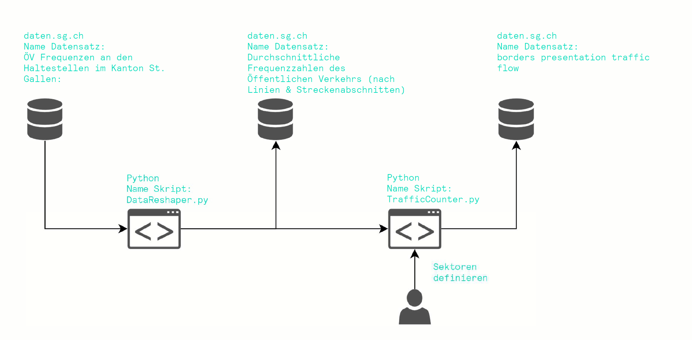

# Open Data Hack St. Gallen
[Open Data Hack St. Gallen](https://opendata-hack-stgallen.devpost.com/) vom 6. November 2021 bis 8. November 2021.

## Team:
https://originate.ch/team/

## Case:

Der folgende Case wird vom Hackathon-Event zur Verfügung gestellt:

**Öffentlicher Verkehr & Personenströme in St. Gallen:** Wie strömt die Bevölkerung in die Stadt St.Gallen? Identifiziert und visualisiert die ÖV-Korridore in und aus St. Gallen anhand der Frequenzdaten des öffentlichen Verkehrs. *Mögliche Zusätze: Vergleich der Ströme mit dem motorisierten Individualverkehr*, *Auswirkungen einer [Verschiebung des Bahnhofs Bruggen](https://www.tagblatt.ch/ostschweiz/stgallen/vision-die-bahnhoefe-bruggen-und-haggen-zu-einem-neuen-bahnhof-kombinieren-jetzt-prueft-stgallen-die-machbarkeit-ld.2111948) auf die Kapazitäten der Linien*

Unser Ziel orientiert sich an dieser Fragestellung. Wir haben versucht, die Personenströme des öffentlichen Verkehrs im Kanton St. Gallen darzustellen. Dies auf zwei Arten: entlang der Verkehrsachsen und über frei definierbare Grenzen hinweg.

## Datensatz

ÖV Frequenzen an den Haltestellen im Kanton St. Gallen:
 https://daten.sg.ch/explore/dataset/frequenzen-offentlicher-verkehr/

## Datenlage

Zur Zeit stehen nur durchschnittliche Tageswerte über ein Jahr zur Verfügung. Somit ist eine Auflösung nach Uhrzeit und Datum nicht möglich. Somit sind auch zeitlich definierte Auslastungen der ÖV Fahrzeugen nicht möglich

Der Ausgangsdatensatz hat auch nur Informationen der regionalen Verkehrsunternehmen. Die Daten des Fernverkehrs fehlen.

Die Daten aus jüngerer Zeit weisen - unserer Ansicht nacht - eine höhere Qualität aus.

## Umsetzung

Im ersten Schritt wird der auf daten.sg.ch zur Verfügung gestellte Datensatz zu den ÖV Frequenzen an den Haltestellen umgebaut. Das heisst, dass die Personen-Besetzung und die Ein- und Ausstiege von den ÖV Fahrzeugen an den Haltestellen auf die Strecke umgerechnet wird. Somit weiss man, wie viele Personen 

Anschliessend kann über eine freidefinierbare Linie eine Grenze erstellt werden. Mit dem neuen Datensatz kann die Frequenz an der Grenze berechnet werden. Dies gibt Transparenz, wie viele Personen diese Grenze passieren.

## Anwendung
Das erste Skript `DataReshaper.py` dient dazu, den Datensatz zu den Haltestellenfrequenzen zu Bereinigen und die Information auf Strecken zwischen den Haltestellen zu übertragen. Das zweite Skript `TrafficCounter.py` benutzt diesen angepassten Datensatz, um den Personenfluss über Grenzen zu berechnen. Diese Grenzen müssen in einem JSON File definiert sein.

## Ausblick 

Verschiedene Erweiterungen der bisherigen Lösung sind denkbar:
- Auswerten und Vergleich anderer Verkehrsteilnehmer, insbesondere Velo und motorisierter Individualverkehr
- Genauere Auflösung des Verkehrsflusses durch Informationen aus [Liniennetzplan](https://daten.sg.ch/explore/dataset/ov-vbsg%40stadt-stgallen/information/?disjunctive.linie&dataChart=eyJxdWVyaWVzIjpbeyJjb25maWciOnsiZGF0YXNldCI6Im92LXZic2dAc3RhZHQtc3RnYWxsZW4iLCJvcHRpb25zIjp7ImRpc2p1bmN0aXZlLmxpbmllIjp0cnVlLCJzb3J0IjoibGluaWUifX0sImNoYXJ0cyI6W3siYWxpZ25Nb250aCI6dHJ1ZSwidHlwZSI6ImNvbHVtbiIsImZ1bmMiOiJDT1VOVCIsInNjaWVudGlmaWNEaXNwbGF5Ijp0cnVlLCJjb2xvciI6IiMxOTYzMEEifV0sInhBeGlzIjoibGluaWUiLCJtYXhwb2ludHMiOjUwLCJzb3J0IjoiIn1dLCJ0aW1lc2NhbGUiOiIiLCJkaXNwbGF5TGVnZW5kIjp0cnVlLCJhbGlnbk1vbnRoIjp0cnVlfQ%3D%3D&location=17,47.41992,9.36728&basemap=jawg.streets)
- Erweitern des Python-Skript für das Berechnen des Grenzverkehrs mit einer REST-API, damit Datensätze dynamisch generiert werden können
- Verwenden des Tools zur Erfassung von Transitverkehr

